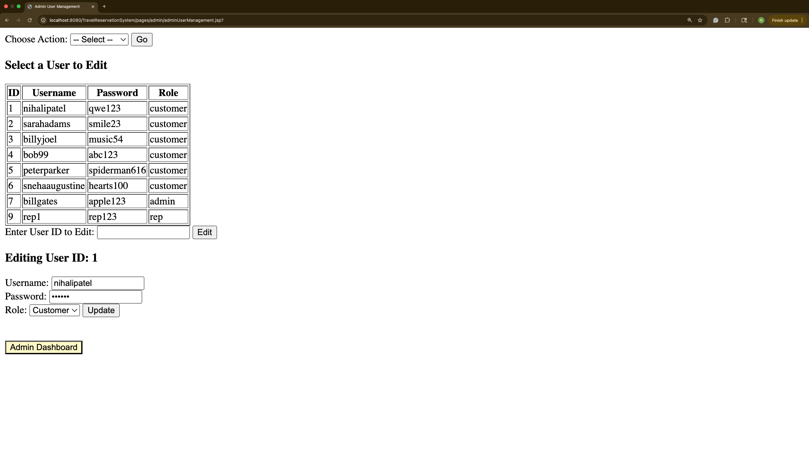

# Travel Reservation System
*A full-stack flight booking platform for customers, admins, and representatives to manage flights, tickets, and services with intelligent waitlisting and flexible search options.*

---

## Description

The Travel Reservation System simulates an airline reservation system for booking, modifying, and analyzing flight data. It supports three roles: **Customers**, **Administrators**, and **Customer Representatives**, each with their own set of permissions and views.

Built using **Java (backend)**, **MySQL (database)**, and **JSP/HTML/CSS (frontend)** to gain hands-on experience with full-stack development and relational databases in an end-to-end airline application.

### ✅ Features by Role

#### 👤 Customer:
- Search for flights:
  - One-way or round-trip on fixed or flexible dates (+/- 3 days)
- Browse, filter, and sort flights by:
  - Price, take-off/landing time, duration, airline, stops
- Make reservations / purchase tickets
- Join waiting lists if a flight is full
- Cancel reservations (if Business or First Class)
- View past and upcoming reservations
- Ask and browse questions and answers
- Receive alerts when a waitlisted seat becomes available

#### 🛠️ Admin:
- Add/Edit/Delete customers or customer representatives
- View sales reports by month
- Generate reports by:
  - Flight, customer, or airline revenue
  - Most active flights
  - Top-revenue customers
- Lookup reservations by flight number or customer name

#### 🧑‍💼 Customer Representative:
- Make or edit reservations for users
- Manage flights, airports, and aircraft data
- Retrieve waitlists for specific flights
- View all flights for a given airport
- Respond to user questions

---

## 🔧 Ongoing Improvements
- Refactoring code for clarity and modularity  
- Adding authentication, UI enhancements, and error handling  
- Further normalization of the database schema where applicable  
- Integrating tools such as REST APIs  

---

## 💾 Installation

**Clone the repository**
   
bash
   git clone https://github.com/nih33/TravelReservationSystem.git
   cd TravelReservationSystem should i add that it was a partnered project for prin info cs 336, and my plans of cleaning it, implementing additional tools, normalizing the databases further where possible

## 🔐 Sample Credentials

Test credentials are included in [`README.txt`](./README.txt).

---

## 🧩 Database Design

- [ER Diagram (Hand-drawn)](./ER_Diagram.pdf)  
- [MySQL Schema Screenshot](./TravelReservationSchema.png)

---

## 🖼️ Demo

A preview of the system interface can be found here:  


---

## 🗃️ SQL Dump

You can recreate the database with:

```bash
mysql -u root -p TravelReservation < TravelReservation.sql
   
